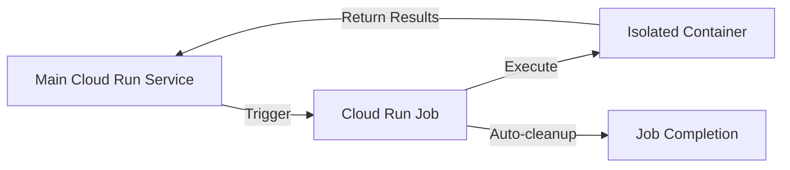

# Google Cloud Sandbox Alternatives Research Report

**Date**: 2025-12-28  
**Purpose**: Research viable GCP alternatives to replace Docker-based sandboxing that fails in Cloud Run

---

## Executive Summary

The current system uses **Docker-in-Docker (DinD)** sandboxing via [`DockerSandbox`](backend/app/infrastructure/external/sandbox/docker_sandbox.py:65) which **cannot work in Cloud Run** because:

1. **Cloud Run does not provide Docker socket access** - No `/var/run/docker.sock` mounting
2. **Cloud Run runs in gVisor** - Provides kernel-level isolation that prevents nested containers
3. **Cloud Run lacks privileged mode** - Required for Docker-in-Docker operations
4. **Security restrictions** - Cloud Run's sandbox prevents container creation from within containers

### Current Docker Sandbox Architecture

```python
# From backend/app/infrastructure/external/sandbox/docker_sandbox.py
class DockerSandbox(Sandbox):
    """
    Stateful Docker Sandbox with session context preservation.
    
    - Creates Docker containers via docker.from_env()
    - Requires Docker socket access (/var/run/docker.sock)
    - Manages container lifecycle (create, exec, destroy)
    - Provides isolated execution environment per session
    """
```

**Key Requirements from Current System:**
- **Isolation**: Separate execution environment per user/session
- **State Preservation**: CWD, environment variables, background processes
- **Resource Limits**: Memory, CPU, timeout controls
- **Cleanup**: Automatic container termination and resource cleanup
- **File Operations**: Upload/download files to/from sandbox
- **Command Execution**: Run shell commands with stateful context
- **Background Processes**: Support for long-running tasks (e.g., web servers)

---

## Problem Analysis

### Why Docker-in-Docker Fails in Cloud Run

```mermaid
graph TD
    A[Cloud Run Container] -->|Tries to use| B[Docker Socket]
    B -->|Not Available| C[FAIL: No /var/run/docker.sock]
    A -->|Tries to run| D[docker.from_env()]
    D -->|Cannot connect| E[FAIL: Docker daemon unreachable]
    A -->|Needs| F[Privileged Mode]
    F -->|Blocked by| G[FAIL: gVisor security]
```

### Current Implementation Dependencies

From [`docker_sandbox.py`](backend/app/infrastructure/external/sandbox/docker_sandbox.py:427):
```python
docker_client = docker.from_env()  # Fails in Cloud Run
container = docker_client.containers.run(...)  # Cannot create containers
```

---

## GCP Alternative Solutions

### Option 1: **Cloud Run Jobs** (⭐ RECOMMENDED)

**Overview**: Execute isolated tasks as separate Cloud Run Job executions

#### Architecture



#### Implementation Approach

```python
from google.cloud import run_v2

class CloudRunJobSandbox(Sandbox):
    """
    Execute commands as isolated Cloud Run Jobs
    """
    
    async def exec_command_stateful(self, command: str, session_id: str):
        # 1. Create ephemeral Cloud Run Job
        job_client = run_v2.JobsClient()
        
        job = run_v2.Job(
            template=run_v2.ExecutionTemplate(
                template=run_v2.TaskTemplate(
                    containers=[run_v2.Container(
                        image="gcr.io/project/sandbox-executor:latest",
                        command=["/bin/sh", "-c", command],
                        resources=run_v2.ResourceRequirements(
                            limits={"memory": "512Mi", "cpu": "1"}
                        )
                    )],
                    timeout="300s",
                    max_retries=0
                )
            )
        )
        
        # 2. Execute and wait for completion
        execution = job_client.run_job(name=job.name)
        
        # 3. Retrieve results from Cloud Storage or Firestore
        return await self._get_execution_results(execution.name)
```

#### Pros ✅
- **Native GCP service** - Fully managed, no infrastructure
- **True isolation** - Each job runs in separate container
- **Auto-scaling** - Scales to zero when not in use
- **Resource limits** - Built-in memory/CPU/timeout controls
- **No Docker socket needed** - Uses GCP's container runtime
- **Cost-effective** - Pay only for execution time
- **Secure** - Cloud Run's security model applies

#### Cons ❌
- **Cold start latency** - ~1-3 seconds for job initialization
- **No persistent state** - Each job is ephemeral (need external state storage)
- **Complexity** - Requires state management in Cloud Storage/Firestore
- **Asynchronous pattern** - Jobs run asynchronously, need polling or pub/sub
- **Quota limits** - Max 1000 concurrent jobs per project

#### Security Mapping

| Current Requirement | Cloud Run Jobs Solution |
|-------------------|------------------------|
| Container isolation | ✅ Native gVisor isolation |
| Resource limits | ✅ Memory/CPU limits in job spec |
| Automatic cleanup | ✅ Auto-deleted after completion |
| Network isolation | ✅ VPC connector support |
| File access control | ✅ IAM-based access to Cloud Storage |

---

### Option 2: **Cloud Functions (2nd Gen)**

**Overview**: Execute code in isolated function instances

#### Architecture

```python
from google.cloud import functions_v2

class CloudFunctionSandbox(Sandbox):
    """
    Execute commands via Cloud Functions
    """
    
    async def exec_command_stateful(self, command: str, session_id: str):
        # Deploy ephemeral function or use pre-deployed executor
        function_client = functions_v2.FunctionServiceClient()
        
        # Invoke function with command
        response = await self._invoke_function(
            function_name="sandbox-executor",
            data={"command": command, "session_id": session_id}
        )
        
        return response
```

#### Pros ✅
- **Fastest cold start** - <1 second typically
- **Simpler than Jobs** - Less configuration overhead
- **Event-driven** - Can trigger from Pub/Sub, HTTP, etc.
- **Automatic scaling** - Handles concurrent requests
- **Built-in timeout** - Configurable up to 9 minutes (2nd gen)

#### Cons ❌
- **Limited runtime** - Max 9 minutes execution (vs 24 hours for Jobs)
- **Memory constraints** - Max 16GB memory
- **No shell access** - Must implement command execution in function code
- **Stateless** - No built-in session state (need external storage)
- **Language-specific** - Must write executor in supported language (Python, Node.js, Go, etc.)

---

### Option 3: **GKE Autopilot with gVisor**

**Overview**: Run sandboxed workloads on Google Kubernetes Engine with gVisor isolation

#### Architecture

```yaml
apiVersion: v1
kind: Pod
metadata:
  name: sandbox-executor
  annotations:
    container.apparmor.security.beta.kubernetes.io/sandbox: runtime/default
spec:
  runtimeClassName: gvisor  # Use gVisor for enhanced isolation
  containers:
  - name: sandbox
    image: gcr.io/project/sandbox-executor
    resources:
      limits:
        memory: "512Mi"
        cpu: "500m"
    securityContext:
      runAsNonRoot: true
      readOnlyRootFilesystem: true
```

#### Pros ✅
- **Most flexible** - Full Kubernetes capabilities
- **gVisor isolation** - Kernel-level security (similar to Cloud Run)
- **Persistent state** - Can use volumes for session state
- **Long-running** - No execution time limits
- **Custom networking** - Full network policy control

#### Cons ❌
- **Complex setup** - Requires Kubernetes expertise
- **Higher cost** - Always-on cluster costs (even with Autopilot)
- **Operational overhead** - More management required than serverless
- **Slower scaling** - Pod startup slower than serverless functions

---

### Option 4: **Vertex AI Custom Containers**

**Overview**: Execute workloads in Vertex AI custom training/prediction containers

#### Use Case
Best for ML/AI workloads, not general-purpose sandboxing

#### Pros ✅
- **GPU support** - If needed for ML tasks
- **Pre-configured ML environment** - TensorFlow, PyTorch, etc.
- **Managed scaling** - Auto-scales prediction endpoints

#### Cons ❌
- **Overkill for simple execution** - Designed for ML workloads
- **Higher cost** - ML infrastructure pricing
- **Slower** - Not optimized for quick task execution
- **Less flexible** - Tailored for ML use cases

---

### Option 5: **Cloud Composer (Airflow)**

**Overview**: Orchestrate complex workflows with isolated task execution

#### Use Case
Best for scheduled/orchestrated workflows, not real-time sandboxing

#### Pros ✅
- **Workflow orchestration** - Complex DAGs with dependencies
- **Retry logic** - Built-in error handling
- **Monitoring** - Rich UI for task status

#### Cons ❌
- **High latency** - Minutes to start tasks, not seconds
- **Complex** - Requires Airflow knowledge
- **Expensive** - Always-on Composer environment
- **Not real-time** - Batch-oriented, not interactive

---

## Comparison Matrix

| Feature | Cloud Run Jobs | Cloud Functions | GKE Autopilot | Vertex AI | Composer |
|---------|---------------|-----------------|---------------|-----------|----------|
| **Setup Complexity** | ⭐⭐ Low | ⭐ Very Low | ⭐⭐⭐⭐ High | ⭐⭐⭐ Medium | ⭐⭐⭐⭐ High |
| **Cold Start** | ~2-3s | ~0.5-1s | ~10-30s | ~30-60s | ~2-5 min |
| **Max Runtime** | 24 hours | 9 minutes | Unlimited | Hours | Unlimited |
| **Isolation Level** | ⭐⭐⭐⭐⭐ Excellent | ⭐⭐⭐⭐ Very Good | ⭐⭐⭐⭐⭐ Excellent | ⭐⭐⭐⭐ Very Good | ⭐⭐⭐ Good |
| **Cost (idle)** | $0 | $0 | ~$50/month | ~$100/month | ~$300/month |
| **Cost (active)** | ⭐⭐⭐⭐ Low | ⭐⭐⭐⭐⭐ Very Low | ⭐⭐⭐ Medium | ⭐⭐ High | ⭐ Very High |
| **Scalability** | ⭐⭐⭐⭐⭐ Excellent | ⭐⭐⭐⭐⭐ Excellent | ⭐⭐⭐⭐ Very Good | ⭐⭐⭐ Good | ⭐⭐ Limited |
| **State Management** | External | External | Internal/External | External | External |
| **Real-time** | ⭐⭐⭐⭐ Very Good | ⭐⭐⭐⭐⭐ Excellent | ⭐⭐⭐⭐ Very Good | ⭐⭐ Fair | ⭐ Poor |
| **Security** | ⭐⭐⭐⭐⭐ Excellent | ⭐⭐⭐⭐⭐ Excellent | ⭐⭐⭐⭐⭐ Excellent | ⭐⭐⭐⭐ Very Good | ⭐⭐⭐ Good |
| **Operational Overhead** | ⭐⭐ Low | ⭐ Very Low | ⭐⭐⭐⭐ High | ⭐⭐⭐ Medium | ⭐⭐⭐⭐ High |

---

## Recommended Solution

### **🏆 Option 1: Cloud Run Jobs** (Primary Recommendation)

**Why Cloud Run Jobs?**

1. **Best fit for current architecture** - Replaces Docker containers with Cloud Run containers
2. **Serverless** - No infrastructure management, scales to zero
3. **Cost-effective** - Pay only for execution time (~$0.00002 per second)
4. **Secure by default** - Cloud Run's security model + IAM
5. **Simple migration path** - Similar container-based approach

### Implementation Strategy

#### Phase 1: Core Execution Engine

```python
# backend/app/infrastructure/external/sandbox/cloudrun_job_sandbox.py

from google.cloud import run_v2
from google.cloud import storage
import asyncio
import uuid

class CloudRunJobSandbox(Sandbox):
    """
    Execute commands as isolated Cloud Run Jobs
    Replaces DockerSandbox for Cloud Run deployment
    """
    
    def __init__(self, project_id: str, region: str = "us-central1"):
        self.project_id = project_id
        self.region = region
        self.job_client = run_v2.JobsClient()
        self.storage_client = storage.Client()
        self.bucket_name = f"{project_id}-sandbox-sessions"
        
    async def exec_command_stateful(
        self, 
        command: str, 
        session_id: str = "default",
        timeout: int = 120
    ) -> Dict[str, Any]:
        """
        Execute command in isolated Cloud Run Job
        
        Flow:
        1. Store session state in Cloud Storage
        2. Create Cloud Run Job with command
        3. Job loads state, executes command, saves new state
        4. Retrieve results and updated state
        """
        
        # 1. Prepare session state
        session_state = await self._load_session_state(session_id)
        execution_id = str(uuid.uuid4())
        
        # 2. Create job
        job_name = f"sandbox-exec-{execution_id[:8]}"
        job = await self._create_job(
            job_name=job_name,
            command=command,
            session_id=session_id,
            session_state=session_state,
            timeout=timeout
        )
        
        # 3. Execute job
        execution = await self._run_job(job_name)
        
        # 4. Wait for completion and retrieve results
        result = await self._wait_and_get_results(execution_id, timeout)
        
        # 5. Update session state
        await self._save_session_state(session_id, result["new_state"])
        
        return {
            "exit_code": result["exit_code"],
            "stdout": result["stdout"],
            "stderr": result["stderr"],
            "cwd": result["new_state"]["cwd"],
            "session_id": session_id
        }
```

#### Phase 2: Session State Management

```python
# State storage in Cloud Storage or Firestore

class SessionStateManager:
    """
    Manage session state across job executions
    """
    
    async def load_state(self, session_id: str) -> Dict:
        """Load session state from Cloud Storage"""
        blob = self.bucket.blob(f"sessions/{session_id}/state.json")
        if blob.exists():
            return json.loads(blob.download_as_text())
        return {
            "cwd": "/workspace",
            "env_vars": {},
            "background_pids": {}
        }
    
    async def save_state(self, session_id: str, state: Dict):
        """Save session state to Cloud Storage"""
        blob = self.bucket.blob(f"sessions/{session_id}/state.json")
        blob.upload_from_string(json.dumps(state))
```

#### Phase 3: Job Executor Container

```dockerfile
# sandbox-executor/Dockerfile
FROM python:3.12-slim

WORKDIR /workspace

# Install required tools
RUN apt-get update && apt-get install -y \
    curl \
    git \
    nodejs \
    npm \
    && rm -rf /var/lib/apt/lists/*

# Copy executor script
COPY executor.py /usr/local/bin/executor.py

# Run as non-root user
RUN useradd -m -u 1000 sandbox
USER sandbox

ENTRYPOINT ["python", "/usr/local/bin/executor.py"]
```

```python
# sandbox-executor/executor.py
"""
Executor script that runs inside Cloud Run Job
"""
import os
import json
import subprocess
from google.cloud import storage

def main():
    # 1. Load session state from Cloud Storage
    session_id = os.environ["SESSION_ID"]
    execution_id = os.environ["EXECUTION_ID"]
    command = os.environ["COMMAND"]
    
    storage_client = storage.Client()
    bucket = storage_client.bucket(os.environ["BUCKET_NAME"])
    
    # Load state
    state_blob = bucket.blob(f"sessions/{session_id}/state.json")
    state = json.loads(state_blob.download_as_text())
    
    # 2. Apply session state
    os.chdir(state["cwd"])
    for key, value in state["env_vars"].items():
        os.environ[key] = value
    
    # 3. Execute command
    result = subprocess.run(
        command,
        shell=True,
        capture_output=True,
        text=True,
        timeout=int(os.environ.get("TIMEOUT", "120"))
    )
    
    # 4. Capture new state
    new_state = {
        "cwd": os.getcwd(),
        "env_vars": dict(os.environ),
        "background_pids": state["background_pids"]  # TODO: Handle background processes
    }
    
    # 5. Save results and new state
    result_blob = bucket.blob(f"executions/{execution_id}/result.json")
    result_blob.upload_from_string(json.dumps({
        "exit_code": result.returncode,
        "stdout": result.stdout,
        "stderr": result.stderr,
        "new_state": new_state
    }))

if __name__ == "__main__":
    main()
```

---

## Security Considerations

### Isolation Requirements Mapping

| Requirement | Docker Sandbox | Cloud Run Jobs Solution |
|-------------|---------------|------------------------|
| **Process Isolation** | Docker container boundaries | gVisor kernel-level isolation |
| **Resource Limits** | `docker run --memory --cpus` | Cloud Run Job resource limits |
| **Network Isolation** | Docker networks | VPC connector + firewall rules |
| **File System Isolation** | Container filesystem | Ephemeral job filesystem |
| **User Isolation** | Container user namespaces | IAM service accounts |
| **Automatic Cleanup** | Container auto-remove | Job auto-deletion |

### Security Enhancements

1. **Service Account per Job** - Each job runs with minimal IAM permissions
2. **VPC Service Controls** - Restrict API access
3. **Binary Authorization** - Verify container images before execution
4. **Audit Logging** - Cloud Audit Logs for all job executions
5. **Secret Management** - Use Secret Manager, not environment variables

---

## Cost Estimation

### Current Docker Sandbox (on Cloud Run)
**Status**: ❌ Does not work - No cost because functionality is broken

### Cloud Run Jobs Alternative

**Assumptions**:
- 1000 command executions per day
- Average execution time: 5 seconds
- Memory: 512 MB
- CPU: 1 vCPU

**Calculation**:
```
Execution time: 1000 * 5s = 5,000 seconds/day
Monthly: 5,000 * 30 = 150,000 seconds

Cost per vCPU-second: $0.00002400
Cost per GB-second: $0.00000250

CPU cost: 150,000 * $0.00002400 = $3.60/month
Memory cost: 150,000 * 0.5 * $0.00000250 = $0.19/month

Total: ~$4/month
```

**Additional Costs**:
- Cloud Storage (state storage): ~$0.50/month
- Cloud Functions (orchestration): ~$1/month
- **Total**: ~$5.50/month

**Comparison**:
- GKE Autopilot: ~$75/month (always-on cluster)
- Cloud Composer: ~$300/month (always-on environment)
- **Cloud Run Jobs**: ~$5.50/month ✅ **Most cost-effective**

---

## Migration Path

### Step 1: Prototype (1-2 weeks)
- [ ] Create sandbox-executor container image
- [ ] Implement basic CloudRunJobSandbox class
- [ ] Test simple command execution
- [ ] Verify state persistence

### Step 2: Feature Parity (2-3 weeks)
- [ ] Implement stateful session management
- [ ] Add background process support
- [ ] Implement file upload/download
- [ ] Add timeout and resource limits

### Step 3: Integration (1-2 weeks)
- [ ] Replace DockerSandbox with CloudRunJobSandbox
- [ ] Update configuration and environment variables
- [ ] Test with existing agent workflows
- [ ] Performance benchmarking

### Step 4: Deployment (1 week)
- [ ] Deploy to staging environment
- [ ] Run integration tests
- [ ] Monitor performance and costs
- [ ] Deploy to production

**Total Estimated Time**: 5-8 weeks

---

## Alternative: Hybrid Approach

### For Development/Testing
**Use Docker Sandbox locally** - Keep current implementation for local development

### For Production (Cloud Run)
**Use Cloud Run Jobs** - Seamless cloud execution

```python
# backend/app/infrastructure/external/sandbox/factory.py

def get_sandbox() -> Sandbox:
    """
    Factory method to get appropriate sandbox based on environment
    """
    settings = get_settings()
    
    if settings.environment == "production":
        # Cloud Run Jobs for production
        return CloudRunJobSandbox(
            project_id=settings.gcp_project_id,
            region=settings.gcp_region
        )
    else:
        # Docker sandbox for local development
        return DockerSandbox()
```

---

## Conclusion

**Recommended Solution: Cloud Run Jobs**

Cloud Run Jobs provides the best balance of:
- ✅ Functionality (replaces Docker containers)
- ✅ Security (gVisor isolation + IAM)
- ✅ Cost (~$5/month vs $75-300 for alternatives)
- ✅ Simplicity (serverless, no infrastructure)
- ✅ Migration path (similar container-based approach)

**Next Steps**:
1. Get user approval for Cloud Run Jobs approach
2. Create prototype implementation
3. Test with real workloads
4. Plan full migration
